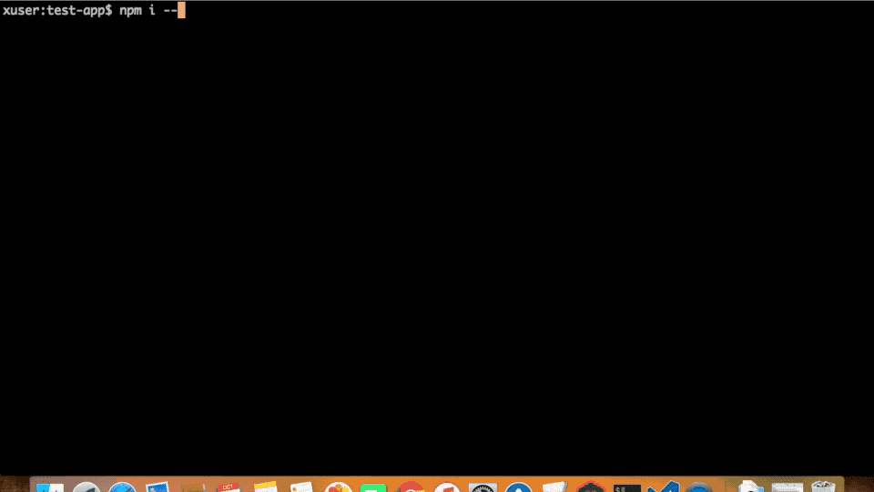

# batman-cli
batman-cli is an advance command runner tool. Easy to maintain command runner. Easy to config via external json or js.
## How to install
```bash
# As a global module
npm i -g batman-cli
####################
# As a local module
npm i batman-cli --save-dev
```
** Demo:** 
 [](https://www.youtube.com/watch?v=DtZ6CLPxezM)
** Youtube: ** 
https://www.youtube.com/watch?v=DtZ6CLPxezM
## How to configure 
1.  Using package.json 
```js
// Inside package.json
"batman": {
	// translated command:  ng new app1 --dry-run=true --inline-style=true
	"e2e:cucumber": { //command name that batman will refer
		"command": "ng e2e", //actual command that batman will execute
		"desc": "Run e2e with cucumber", //description
		"params": [], //extra params user want to pass with command, like. --prod
		"envs": ["TEST=ENV", "TEST2=$MOCK"], //enviroment variables, it can take enviroment variable to build envs
		"options": { //options requires by actual command ex. ng
			"--serve": false,
			"--config": "./e2e/config/protractor.cucumber.conf.js",
			"-wu": "false"
		}
	},
	"new": "ng new testapp", //simple command without description
	"test": "ng test --code-coverage", // command without description
	"install": ["npm install", "Install node modules"] // command with description
}
```
2.  Using external config inside package.json 
```js
// In package.json, config path from root of project
// Using path module, path.resolve(process.cwd(), config)
// Hack if needed
"batman": {
  "config": "./batman.config.js" //or batman.config.json(js and json both supported)
}
// batman.config.js or batman.config.json both will work
module.exports = {
  //same as above
}
```
## How to use
1. As global module 
Install as global module, and simply use
```bash
batman e2e:cucumber
# This will read your current location package.json, parse batman commands
# Once found e2e:cucumber, will execute.
```
2. As local module, using npm
Install as local module, and simply configure package.json
```js
//package.json
{
    //...rest of the prop
  "scripts": {
    "batman": "batman",
    "e2e:cucumber": "batman e2e:cucumber"
  },
  "batman" : { 
    //Super configuration here
  }
}
```
```bash
# Run using npm
npm run e2e:cucumber
# This will read your current location package.json, parse batman commands
# Once found e2e:cucumber, will execute.
```
## Advance config 
All the options and env supports enviroment variables, So user can replace value using $Enviroment variable
```js
//Example
"e2e:cucumber": { //command name that batman will refer
	"command": "ng e2e", //actual command that batman will execute
	"desc": "Run e2e with cucumber", //description
	"params": [], //extra params user want to pass with command, like. --prod
	"envs": ["TEST=ENV", "TEST2=$MOCK"], //enviroment variables, it can take enviroment variable to build envs
	"options": { //options requires by actual command ex. ng
		"--serve": false,
		"--config": "./e2e/config/protractor.cucumber.conf.js",
		"-wu": "false"
	}
	}
```
Issues+Suggestions: https://github.com/deepakshrma/batman-cli/issues